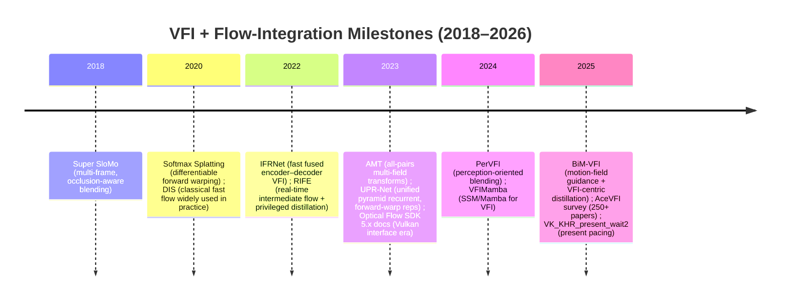

# Ultra-Low-Latency Real-Time VFI Pipeline Research Map

## Executive summary

You’re building an ultra-low-latency, real-time Video Frame Interpolation (VFI) stack for gaming, with **(a) hardware/heuristic optical flow injected into a fused neural decoder**, **(b) INT8 PTQ + TensorRT**, and **(c) zero-copy capture→infer→present (DXGI/Vulkan)**. **Target GPU model is unspecified**, so performance/interop notes below are **GPU-agnostic where possible** and explicitly cite the few places where papers used a specific GPU/resolution. citeturn42view0turn18view0turn38view2

Three “load-bearing” design patterns dominate recent low-latency VFI literature and deployment practice:

A single-pass (or single-engine) VFI model that **jointly predicts flows + occlusion mask + residual** is the easiest to harden for latency because it minimizes extra passes and memory traffic. AMT explicitly formulates interpolation as backward warping with an occlusion mask and a learned residual, and then extends it with multi-field candidates to reduce ambiguity in occlusions. citeturn41view0turn43view2

A hybrid architecture where you **replace or seed the network’s flow** with **hardware flow (NVOFA)** or a cheap classical flow (DIS) is viable because (i) NVOFA runs independently of CUDA cores and exposes CUDA/DirectX/Vulkan interfaces, and (ii) many learnable flow estimators already support initialization / iterative refinement hooks (e.g., RAFT’s `flow_init`). citeturn18view0turn16view0turn38view2turn44search1

The real deployment cliff is not “the network”; it’s **memory movement + synchronization**. Desktop Duplication yields a DXGI surface (BGRA) and is explicitly meant to let you process frames on the GPU; CUDA supports Direct3D and Vulkan interop through resource mapping and external memory, and NVIDIA’s `vulkanImageCUDA` sample demonstrates Vulkan↔CUDA external memory + semaphore sync patterns you can adapt to TensorRT bindings. citeturn38view0turn38view2turn27view1turn19search6

### Comparison table for top low-latency VFI models

All latency/params/FLOPs numbers below are **reported by the AMT paper** as **average inference time per interpolated frame** on **1280×720** with **1000 iterations** on an **RTX 3090** (so treat as *relative* performance guidance, not a universal SLA). citeturn42view0turn43view1turn43view2

| Model (top picks for real-time) | Year | Reported latency (ms/frame @720p) | Params (M) | FLOPs (T @720p) | Single-pass vs cascaded (practical view) | GitHub |
|---|---:|---:|---:|---:|---|---|
| RIFE | 2022 | 29 | 9.8 | 0.20 | **Cascaded refinement** (stacked IFBlocks / coarse-to-fine intermediate-flow refinement) | `https://github.com/hzwer/ECCV2022-RIFE` citeturn43view1turn39view1turn37view2 |
| IFRNet-S | 2022 | 25 | 2.8 | 0.12 | **Fused single-pass encoder–decoder** (flow + feature refine in one model) | `https://github.com/ltkong218/IFRNet` citeturn43view1turn36search8turn36search4 |
| IFRNet-B | 2022 | 30 | 5.0 | 0.21 | **Fused single-pass encoder–decoder** (same design, larger width) | `https://github.com/ltkong218/IFRNet` citeturn43view1turn36search8 |
| AMT-S | 2023 | 51 | 3.0 | 0.12 | **Fused single-pass**, but heavier motion modeling (all-pairs correlation + multi-field candidates) | `https://github.com/MCG-NKU/AMT` citeturn43view1turn40search0turn40search11 |
| IFRNet-L | 2022 | 80 | 19.7 | 0.79 | **Fused single-pass**, larger capacity; good baseline for teacher→student distillation | `https://github.com/ltkong218/IFRNet` citeturn43view2turn36search8 |
| AMT-L | 2023 | 116 | 12.9 | 0.58 | **Fused single-pass**, large model for quality; typically too slow unless heavily optimized (FP16/INT8) | `https://github.com/MCG-NKU/AMT` citeturn43view2turn40search0 |

### Timeline of key VFI + flow-integration milestones

Milestones referenced here: Super SloMo (2018), Softmax Splatting (2020), IFRNet (2022), RIFE (2022), AMT (2023), UPR-Net (2023), PerVFI (2024), VFIMamba (2024), BiM-VFI (2025), AceVFI survey (2025), plus NVOFA SDK 5.x era docs (2023) and Vulkan low-latency extensions (2019–2025). citeturn23search19turn22search15turn36search4turn37view3turn40search11turn29search0turn33search6turn33search7turn33search13turn33search0turn35search2turn25search1turn25search9turn25search3

## Fused vs. cascaded VFI architectures

This section is biased toward **single-pass, encoder–decoder-ish “fused” models** that are easiest to deploy as a single TensorRT engine, plus a few “cascaded/refinement” baselines that matter when you’re deciding how much compute to budget for motion vs synthesis.

| Item | Year | URL | Why it’s directly useful for your hybrid low-lat build |
|---|---:|---|---|
| IFRNet: *Intermediate Feature Refine Network for Efficient Frame Interpolation* (paper + code) | 2022 | Paper: `https://openaccess.thecvf.com/content/CVPR2022/papers/Kong_IFRNet_Intermediate_Feature_Refine_Network_for_Efficient_Frame_Interpolation_CVPR_2022_paper.pdf` ; Code: `https://github.com/ltkong218/IFRNet` | A clean reference for **fusing flow estimation + feature refinement in one encoder–decoder**, which is exactly the shape you want if you plan to **inject hardware flow at the flow head and keep the rest of the decoder intact**; also introduces task-oriented flow distillation that’s deployment-relevant for teacher→student setups. citeturn36search4turn36search8 |
| AMT: *All-Pairs Multi-Field Transforms for Efficient Frame Interpolation* (paper + code) | 2023 | Paper: `https://arxiv.org/pdf/2304.09790` ; Code: `https://github.com/MCG-NKU/AMT` | Strong “modern” fused design: it uses **bidirectional correlation volumes** and **multi-field flow candidates**; the multi-field outputs are a concrete blueprint for handling **occlusion ambiguity** without extra passes, useful when your hardware flow is “mostly right” but wrong where it hurts. citeturn43view1turn41view0turn40search0turn40search11 |
| RIFE: *Real-Time Intermediate Flow Estimation for Video Frame Interpolation* (paper + code) | 2022 | Paper: `https://www.ecva.net/papers/eccv_2022/papers_ECCV/papers/136740608.pdf` ; Code: `https://github.com/hzwer/ECCV2022-RIFE` | Canonical real-time **cascaded refinement** approach: IFNet predicts intermediate flows + fusion mask with a stacked hourglass / coarse-to-fine strategy, and it adds **privileged distillation** for training stability—very transferable if you want a **tiny “flow refiner + mask head”** on top of hardware flow. citeturn37view2turn37view1turn37view3turn39view1 |
| UPR-Net: *A Unified Pyramid Recurrent Network for Video Frame Interpolation* (paper + code) | 2023 | Paper: `https://openaccess.thecvf.com/content/CVPR2023/papers/Jin_A_Unified_Pyramid_Recurrent_Network_for_Video_Frame_Interpolation_CVPR_2023_paper.pdf` ; Code: `https://github.com/srcn-ivl/UPR-Net` | This is close to your “hardware flow + fused neural synthesis” idea: it explicitly states the synthesis network **can be combined with any existing optical flow model**, and it uses **forward-warped representations** across pyramid levels—useful if you treat NVOFA/DIS as the motion backbone and keep a learnable synthesis head. citeturn31view1turn29search17turn29search0 |
| CAIN: *Channel Attention Is All You Need for Video Frame Interpolation* (paper + common codebase) | 2020 | Paper: `https://arxiv.org/abs/2004.11364` ; Code: `https://github.com/myungsub/CAIN` | Flow-free baseline that’s still relevant for deployment: if hardware flow integration becomes messy, CAIN is a useful control to quantify “how much do we gain from explicit flow + warping” vs pure feature-space interpolation (also helpful for INT8 sensitivity comparisons). citeturn43view1turn3search0 |
| M2M-VFI: *Many-to-Many Splatting for Efficient Video Frame Interpolation* (code) | 2022 | `https://github.com/feinanshan/M2M_VFI` | Provides a concrete forward-splatting framework where each source pixel can contribute to multiple targets and vice versa—conceptually aligned with **disocclusion handling** and can inspire a lightweight splat-like layer you might implement as a TensorRT plugin. citeturn23search2turn43view0 |
| AdaCoF: *Adaptive Collaboration of Flows for Video Frame Interpolation* (paper + code) | 2020 | Paper: `https://openaccess.thecvf.com/content_CVPR_2020/html/Lee_AdaCoF_Adaptive_Collaboration_of_Flows_for_Video_Frame_Interpolation_CVPR_2020_paper.html` ; Code: `https://github.com/HyeongminLEE/AdaCoF-pytorch` | A strong reference for **learned, local, adaptive warping** (flow-like but kernelized) that can reduce dependency on perfect flow; useful if your injected hardware flow is blocky and you want the network to “bend” around it. citeturn23search8turn23search0turn43view0 |
| VFIFormer: *Video Frame Interpolation with Transformer* (code) | 2022 | `https://github.com/dvlab-research/vfiformer` | Primarily a “ceiling” baseline: AMT’s paper reports VFIFormer as extremely heavy and even OOM on some tasks; it’s useful as a teacher for distillation, but rarely a direct real-time deployment target. citeturn43view2turn23search6 |
| EMA-VFI: *Extracting Motion and Appearance via Inter-Frame Attention for Efficient VFI* (slow teacher / transformer baseline) | 2023 | Paper: `https://arxiv.org/abs/2304.02818` ; Code: `https://github.com/MCG-NKU/EMA-VFI` | AMT reports EMA-VFI as far higher latency/params than efficient conv nets; in your build it’s most useful as a **teacher** that captures appearance priors while you deploy a smaller INT8 student. citeturn43view3turn40search9 |
| PerVFI: *Perception-Oriented Video Frame Interpolation via Asymmetric Blending* (paper + code) | 2024 | Paper: `https://openaccess.thecvf.com/content/CVPR2024/papers/Wu_Perception-Oriented_Video_Frame_Interpolation_via_Asymmetric_Blending_CVPR_2024_paper.pdf` ; Code: `https://github.com/mulns/PerVFI` | A very relevant “artifact model”: it reframes blur/ghosting as motion-error + supervision mismatch and proposes an explicit asymmetric blending strategy—great ideas to port into a real-time pipeline where **hardware flow is imperfect** and you need robust blending. citeturn33search6turn33search10 |
| VFIMamba: *Video Frame Interpolation with State Space Models* (paper + code) | 2024 | Paper: `https://proceedings.neurips.cc/paper_files/paper/2024/file/c1e9db5e1b04322963af91ac0c943568-Paper-Conference.pdf` ; Code: `https://github.com/MCG-NJU/VFIMamba` | If you’re exploring 2024+ model families, VFIMamba is a key reference for **linear-complexity inter-frame modeling**; likely not your first real-time deployment, but important for understanding where VFI might go beyond convs/transformers. citeturn33search7turn33search3 |
| BiM-VFI: *Bidirectional Motion Field-Guided Frame Interpolation for Video with Non-uniform Motions* | 2025 | Paper: `https://openaccess.thecvf.com/content/CVPR2025/papers/Seo_BiM-VFI_Bidirectional_Motion_Field-Guided_Frame_Interpolation_for_Video_with_Non-uniform_CVPR_2025_paper.pdf` | Crucial for “gaming-like” motion: explicitly targets non-uniform motion (accel/decel/direction changes) and includes a **VFI-centric distillation** concept; relevant if you want to train a student that’s robust to engine motion-vectors + NVOFA flow quirks. citeturn33search13turn33search1 |
| AceVFI survey (PhD-level survey anchor) | 2025 | `https://arxiv.org/abs/2506.01061` | The most useful “literature map” right now: it categorizes VFI approaches (flow/hybrid/transformer/mamba/diffusion) and is the fastest way to identify what’s worth distilling into a real-time student. citeturn33search0 |

## Hardware optical flow integration

This section is specifically about **injecting NVOFA / DIS / other heuristic flows into a PyTorch model**, or using them as fast teachers/initializers. This is the core enabler for “hardware flow injected into a fused neural decoder.”

| Item | Year | URL | Why it’s directly useful for your hybrid low-lat build |
|---|---:|---|---|
| NVIDIA Optical Flow SDK landing page | 2026 (maintained; accessed in 2026) | `https://developer.nvidia.com/optical-flow-sdk` | Primary entry point for the hardware OF stack and downloads; treat this as the canonical vendor root for NVOFA/NVOF APIs and supported GPU generations. citeturn35search7 |
| Optical Flow SDK docs index (v5.0 era) | 2023 | `https://docs.nvidia.com/video-technologies/optical-flow-sdk/index.html` | Provides the authoritative doc map (application note, programming guide, FRUC) and anchors the versions you need to be compatible with drivers and interop pathways. citeturn35search2 |
| NVOFA Application Note (PDF) | 2023 | `https://docs.nvidia.com/video-technologies/optical-flow-sdk/pdf/NVOFA_Application_Note.pdf` | Gives the HW facts you must design around: NVOFA is a dedicated accelerator (independent of CUDA cores), supports CUDA/DirectX/Vulkan interfaces, and even supports **external hints**—which is directly relevant if you want to feed engine motion vectors into the OF stage. citeturn17view0turn18view0 |
| NVOFA Programming Guide | 2023 | `https://docs.nvidia.com/video-technologies/optical-flow-sdk/nvofa-programming-guide/index.html` | The programming contract for calling NVOF APIs; use it to implement **GPU-resident flow extraction** that can run in parallel with your TensorRT inference stream scheduling. citeturn35search1 |
| NVIDIA Optical Flow SDK GitHub (samples) | 2026 (repo maintained; year not fixed) | `https://github.com/NVIDIA/NVIDIAOpticalFlowSDK` | Fastest way to steal “known-good” integration patterns for NVOF API usage and resource handling in C++ (then expose to PyTorch via C++ extension or custom op). citeturn35search8 |
| NVOFA FRUC Programming Guide (HTML / PDF) | 2023 | HTML: `https://docs.nvidia.com/video-technologies/optical-flow-sdk/nvfruc-programming-guide/index.html` ; PDF: `https://docs.nvidia.com/video-technologies/optical-flow-sdk/pdf/NVOFA_FRUC.pdf` | Even if you don’t use FRUC directly, it’s a reference implementation of a **flow→forward/backward consistency→infilling→synthesis** chain that is conceptually close to what your hybrid VFI stack will do. citeturn35search0turn35search3 |
| OpenCV CUDA NVOF wrapper (API reference) | 2026 (maintained docs) | `https://docs.opencv.org/4.x/d7/d3f/group__cudaoptflow.html` | If you need a fast prototype path, OpenCV exposes NVOF via `cv::cuda::NvidiaOpticalFlow_*`; it’s useful for validating “hardware flow quality vs VFI quality” before you write bespoke NVOF bindings. citeturn24search1 |
| `cv::cuda::NvidiaOpticalFlow_2_0` class docs | 2026 (maintained docs) | `https://docs.opencv.org/4.x/db/d70/classcv_1_1cuda_1_1NvidiaOpticalFlow__2__0.html` | Concrete API surface for computing NVOF flow in a GPU-friendly OpenCV pipeline; useful when you want to quickly test **different flow presets** and grid sizes before “baking” them into a production C++ module. citeturn24search2 |
| NVIDIA dev blog: OpenCV optical flow with Turing / NVOF | 2019 | `https://developer.nvidia.com/blog/opencv-optical-flow-algorithms-with-nvidia-turing-gpus/` | Shows the integration philosophy (OpenCV wrapper around Optical Flow SDK) and provides example usage—handy when you’re chasing down practical issues like build flags, GPU ordinal, and expected outputs. citeturn24search3 |
| OpenCV DISOpticalFlow (Dense Inverse Search) API docs | 2018–2026 (maintained docs) | `https://docs.opencv.org/4.x/de/d4f/classcv_1_1DISOpticalFlow.html` | DIS is the quintessential “cheap heuristic flow”: OpenCV exposes presets that explicitly trade quality for speed, making it a good baseline flow to inject into a network refiner (or to compare against NVOFA when NVOFA is unavailable). citeturn44search1 |
| DIS paper (seminal for fast heuristic flow) | 2016 (seminal) | `https://arxiv.org/abs/1603.03590` | Explains why DIS can be extremely fast (inverse search + multi-scale aggregation + refinement), so you can reason about **failure modes** (small-fast motions lost, etc.) when DIS is used as your “fallback” flow injector. citeturn44search2 |
| RAFT code: `flow_init` hook for flow warm-start (PyTorch) | 2020–2026 (repo maintained; seminal 2020) | `https://raw.githubusercontent.com/princeton-vl/RAFT/master/core/raft.py` | The forward signature explicitly accepts `flow_init` and adds it into coordinates—this is the cleanest “proof by code” that **external flow can seed a learnable flow estimator**, which is exactly how you’d integrate NVOFA flow as an initialization/hint. citeturn16view0turn38view2 |
| RAFT evaluation script shows warm-start loop | 2020–2026 | `https://raw.githubusercontent.com/princeton-vl/RAFT/master/evaluate.py` | Demonstrates practical warm-starting across sequences (`flow_prev` → `flow_init`)—useful if you plan to amortize motion estimation across frames in a real-time pipeline (e.g., reuse prior flow and only refine). citeturn16view1 |
| FastFlowNet (lightweight optical flow) | 2021 | Paper: `https://arxiv.org/pdf/2103.04524` ; Code: `https://github.com/ltkong218/FastFlowNet` | A compact learnable flow network designed for speed; relevant as a “middle option” if NVOFA flow is unsupported or too noisy for your content, and as a teacher/student candidate for distilling motion priors. citeturn36search1turn36search0 |
| LiteFlowNet (seminal lightweight flow teacher) | 2018 | Paper: `https://openaccess.thecvf.com/content_cvpr_2018/papers/Hui_LiteFlowNet_A_Lightweight_CVPR_2018_paper.pdf` ; Code: `https://github.com/twhui/LiteFlowNet` | IFRNet/AMT-style pipelines often use LiteFlowNet-like pseudo labels; for hybrid VFI, this is useful as a teacher to **align the student’s flow head to a known distribution** when hardware flow is too different. citeturn36search22turn36search2turn41view2 |

## Advanced image warping math

This is the “CUDA kernel + math” layer: splatting/warping, handling many-to-one collisions, and dealing with disocclusions in real time.

image_group{"layout":"carousel","aspect_ratio":"16:9","query":["softmax splatting forward warping illustration","optical flow occlusion mask visualization","many-to-many splatting video frame interpolation diagram","backward warping bilinear sampling optical flow diagram"],"num_per_query":1}

| Item | Year | URL | Why it’s directly useful for your hybrid low-lat build |
|---|---:|---|---|
| Softmax Splatting for VFI (paper) | 2020 | `https://openaccess.thecvf.com/content_CVPR_2020/papers/Niklaus_Softmax_Splatting_for_Video_Frame_Interpolation_CVPR_2020_paper.pdf` | Core forward-warp math: softmax splatting makes forward warps differentiable and addresses many-to-one collisions with a softmax-weighted accumulation—exactly what you need when disocclusions are common and you can’t rely on depth buffers. citeturn22search15 |
| Softmax splatting operator (PyTorch reference impl) | 2020–2026 (repo maintained) | `https://github.com/sniklaus/softmax-splatting` | Practical implementation details (including CUDA/extension patterns) you can mirror when building a **TensorRT plugin** or custom CUDA op that does fast forward splats in your decoder. citeturn22search7 |
| AMT interpolation formulation (mask + residual + backward warp; then multi-field candidates) | 2023 | `https://arxiv.org/pdf/2304.09790` | Gives a modern “production-like” warp equation: intermediate frame = mask·warp + (1-mask)·warp + residual; their extension to multi-field candidates is a precise technique for **ambiguity in occlusions** without introducing new passes. citeturn41view0turn43view1 |
| RIFE IFNet predicts intermediate flows + fusion mask | 2022 | `https://www.ecva.net/papers/eccv_2022/papers_ECCV/papers/136740608.pdf` | RIFE’s IFNet predicts Ft→0, Ft→1 and a fusion mask directly; the paper motivates avoiding separate flow reversal layers due to “object shift,” which matters if your hybrid stack mixes different flow sources. citeturn37view2turn37view4 |
| UPR-Net forward-warped representations across pyramid levels | 2023 | `https://openaccess.thecvf.com/content/CVPR2023/papers/Jin_A_Unified_Pyramid_Recurrent_Network_for_Video_Frame_Interpolation_CVPR_2023_paper.pdf` | Explicitly uses bi-directional flow to generate **forward-warped representations** for synthesis at each pyramid level; this is directly relevant if you want to do “warp once, synthesize many” and reuse motion across multiple inserted frames (important for frame-gen >2×). citeturn29search0turn31view1 |
| M2M-VFI (Many-to-Many splatting) | 2022 | `https://github.com/feinanshan/M2M_VFI` | A more aggressive splatting model where each source pixel maps to multiple targets; good for understanding trade-offs in forward warping when you have to fill holes and not just blend overlaps. citeturn23search2turn43view0 |
| AdaCoF (adaptive collaboration of flows) | 2020 | `https://github.com/HyeongminLEE/AdaCoF-pytorch` | Implements adaptive warping kernels + flow-like components and includes CUDA/cupy bits; useful for alternative warping operators when pure bilinear backward warp artifacts become noticeable at high FPS. citeturn23search0turn23search8 |
| Super SloMo (seminal occlusion-aware blending baseline) | 2018 (seminal) | Paper: `https://openaccess.thecvf.com/content_cvpr_2018/papers/Jiang_Super_SloMo_High_CVPR_2018_paper.pdf` | Still the reference point for occlusion-aware blending logic; valuable mostly as a conceptual baseline for how occlusion masks and flow composition behave under large motion. citeturn23search19 |
| BMBC (bilateral motion + cost volume) | 2020 | Paper: `https://www.ecva.net/papers/eccv_2020/papers_ECCV/papers/123590103.pdf` ; Code: `https://github.com/JunHeum/BMBC` | Strong motion estimation + warping reference using bilateral cost volumes; serves as a “motion quality upper bound” when you gauge how much quality you lose by using hardware flow instead of learned cost volumes. citeturn23search9turn23search1turn43view2 |

## Extreme CNN optimization for VFI

This is where you make real-time happen: INT8 PTQ/QAT decisions, TensorRT dynamic shape profiles, plugins for nonstandard ops (splats/warps), and **teacher–student distillation** specialized to VFI.

| Item | Year | URL | Why it’s directly useful for your hybrid low-lat build |
|---|---:|---|---|
| TensorRT “Working with Quantized Types” (PTQ overview) | 2026 (maintained; year not printed on page) | `https://docs.nvidia.com/deeplearning/tensorrt/latest/inference-library/work-quantized-types.html` | Canonical PTQ definition for TensorRT: explains calibration-data requirements and where accuracy can degrade—critical when your VFI network has sensitive layers (warps/masks) that can break under INT8. citeturn20search0 |
| Torch-TensorRT PTQ guide | 2026 (maintained) | `https://docs.pytorch.org/TensorRT/user_guide/ptq.html` | Practical Python-side PTQ mechanics: shows how to use calibrator caches; relevant if you prototype INT8 calibration quickly in Python before moving to a C++ TensorRT build. citeturn20search2 |
| TensorRT dynamic shapes guide | 2026 (maintained) | `https://docs.nvidia.com/deeplearning/tensorrt/latest/inference-library/work-dynamic-shapes.html` | Essential if you plan to support variable capture sizes (windowed games, different monitor resolutions): dynamic shapes require optimization profiles; otherwise you’ll re-build engines constantly (latency killer). citeturn21search2 |
| TensorRT plugin and custom layers guide | 2026 (maintained) | `https://docs.nvidia.com/deeplearning/tensorrt/latest/inference-library/extending-custom-layers.html` | Your pipeline likely needs custom ops (e.g., softmax splat, special warps, packed BGRA→RGB preprocess). TensorRT plugins are the officially supported path when ONNX lacks a performant mapping. citeturn21search4 |
| TensorRT Python plugin guide (authoring plugins) | 2026 (maintained) | `https://docs.nvidia.com/deeplearning/tensorrt/latest/_static/python-api/pluginGuide.html` | Useful if you iterate on custom ops quickly, then port to C++ for maximum performance; directly relevant for making splatting/warp layers run as fused GPU kernels. citeturn21search11 |
| IFRNet task-oriented flow distillation (paper + repo blurb) | 2022 | Paper: `https://openaccess.thecvf.com/content/CVPR2022/papers/Kong_IFRNet_Intermediate_Feature_Refine_Network_for_Efficient_Frame_Interpolation_CVPR_2022_paper.pdf` ; Code: `https://github.com/ltkong218/IFRNet` | Distillation isn’t optional for your hybrid build: IFRNet explicitly designs a **task-oriented flow distillation loss** to make flow learning VFI-relevant—this idea transfers directly when your teacher is hardware flow or a heavy VFI net. citeturn36search4turn36search8turn41view1 |
| RIFE privileged distillation (paper) | 2022 | `https://www.ecva.net/papers/eccv_2022/papers_ECCV/papers/136740608.pdf` | A highly practical distillation pattern: the teacher gets “privileged” intermediate info and trains the student (real inference network) via a dedicated distillation scheme—useful if you want to use extra signals during training (e.g., engine motion vectors, depth, segmentation) but keep inference minimal. citeturn37view1turn37view3 |
| BiM-VFI VFI-centric flow distillation concept (paper) | 2025 | `https://openaccess.thecvf.com/content/CVPR2025/papers/Seo_BiM-VFI_Bidirectional_Motion_Field-Guided_Frame_Interpolation_for_Video_with_Non-uniform_CVPR_2025_paper.pdf` | Recent, directly relevant distillation framing: it uses knowledge distillation for “VFI-centric” flow supervision—handy when the teacher flow you trust (hardware or heavy net) differs from classic optical-flow objectives. citeturn33search13turn33search1 |
| Knowledge Distillation (seminal) | 2015 (seminal) | `https://arxiv.org/abs/1503.02531` | Baseline theory for teacher→student compression; you’ll use this logic whether your teacher is AMT-L/EMA-VFI or your “privileged” training pipeline with extra motion cues. citeturn36search3 |
| ComfyUI RIFE TensorRT (practical repo) | 2024 | `https://github.com/yuvraj108c/ComfyUI-Rife-Tensorrt` | Not an academic source, but a concrete example of taking a VFI model into TensorRT for speed; useful as a reference for ONNX export quirks, engine building, and runtime integration pitfalls. citeturn22search0 |
| enhancr (TensorRT VFI app) | 2025 (repo active; year not pinned) | `https://github.com/mafiosnik777/enhancr` | End-to-end product-style packaging of VFI + TensorRT; useful for “deployment reality checks” (IO formats, batching, thread model), even if you swap in your own engine. citeturn22search2 |
| TensorRT PTQ improvements blog (8-bit PTQ toolkit) | 2024 | `https://developer.nvidia.com/blog/tensorrt-accelerates-stable-diffusion-nearly-2x-faster-with-8-bit-post-training-quantization/` | While the example is diffusion, it’s one of the clearest official explanations of modern TensorRT PTQ improvements and the kinds of layers that benefit or regress—useful context when you evaluate INT8 vs FP16 for VFI’s warping-heavy graphs. citeturn22search13 |

## Zero-copy real-time rendering pipelines

This is the glue that decides whether your “29 ms model” feels like **29 ms** or **129 ms**. The key facts: Desktop Duplication explicitly returns a DXGI surface intended for GPU processing, CUDA interop supports mapping/importing resources from Direct3D/Vulkan, and Vulkan has explicit extensions to help with present pacing and low latency.

| Item | Year | URL | Why it’s directly useful for your hybrid low-lat build |
|---|---:|---|---|
| Desktop Duplication API overview (Microsoft Learn) | 2021 | `https://learn.microsoft.com/en-us/windows/win32/direct3ddxgi/desktop-dup-api` | Establishes the intended design: apps get a DXGI surface per frame via AcquireNextFrame, and the desktop image format is always BGRA (`DXGI_FORMAT_B8G8R8A8_UNORM`), enabling GPU-side processing with minimal copies. citeturn38view0 |
| `IDXGIOutputDuplication::AcquireNextFrame` docs | 2021 | `https://learn.microsoft.com/en-us/windows/win32/api/dxgi1_2/nf-dxgi1_2-idxgioutputduplication-acquirenextframe` | Defines the key synchronization contract: AcquireNextFrame returns an `IDXGIResource` surface, has timeout semantics, and exposes failure modes like `DXGI_ERROR_ACCESS_LOST`—critical for robust capture in real games (fullscreen switches, mode changes). citeturn38view1 |
| Windows classic sample: DXGI Desktop Duplication | 2026 (repo maintained; sample is longstanding) | `https://github.com/microsoft/Windows-classic-samples/blob/main/Samples/DXGIDesktopDuplication/README.md` | Provides a working reference for capture + rect updates; a good base if you want to fork and replace “CPU readback” with **CUDA interop + TensorRT bindings**. citeturn28search0 |
| CUDA Programming Guide: Interoperability concepts | 2025 | `https://docs.nvidia.com/cuda/cuda-programming-guide/04-special-topics/graphics-interop.html` | The authoritative API model: (1) **graphics interop mapping** (register→map→get pointer/array) and (2) **external resource interoperability** via OS handles; this is the conceptual foundation for true zero-copy DXGI/Vulkan→CUDA→TensorRT. citeturn38view2turn34search2 |
| CUDA sample: Direct3D11 texture interop | 2022 (code header) | `https://raw.githubusercontent.com/NVIDIA/cuda-samples/master/Samples/5_Domain_Specific/simpleD3D11Texture/simpleD3D11Texture.cpp` | Concrete “DX11 texture ↔ CUDA” glue example, including the correct include stack and resource handling pattern; you’ll adapt this so the mapped CUDA array feeds TensorRT input bindings without staging copies. citeturn27view2turn19search8 |
| CUDA sample: Direct3D12 interop | 2022 (code header) | `https://raw.githubusercontent.com/NVIDIA/cuda-samples/master/Samples/5_Domain_Specific/simpleD3D12/simpleD3D12.cpp` | Useful if your capture/render path is DX12: shows D3D12↔CUDA interop scaffolding; important for “modern game” compatibility where D3D11-only assumptions can break. citeturn27view0turn26search1 |
| CUDA sample: Vulkan image ↔ CUDA interop (external memory + semaphores) | 2022 (repo sample; docs maintained) | README: `https://github.com/NVIDIA/cuda-samples/blob/master/Samples/5_Domain_Specific/vulkanImageCUDA/README.md` | Demonstrates Vulkan image memory imported into CUDA and synchronized via imported Vulkan semaphores—this is the closest “official” template to a Vulkan-presenting, CUDA/TensorRT-processing, **zero-copy** pipeline. citeturn19search6turn27view1turn34search5 |
| Vulkan guide: External memory and synchronization | 2026 (maintained guide) | `https://docs.vulkan.org/guide/latest/extensions/external.html` | Authoritative overview for importing/exporting memory and sync primitives across APIs; necessary when you want to write into a Vulkan swapchain image from CUDA (post-inference) without extra copies. citeturn34search6turn19search20 |
| Vulkan extension: `VK_KHR_present_wait` | 2019 | `https://docs.vulkan.org/refpages/latest/refpages/source/VK_KHR_present_wait.html` | Lets you wait for present completion, enabling explicit control over the number of outstanding presents—useful for keeping the pipeline shallow (lower latency) rather than buffering frames. citeturn25search1 |
| Vulkan extension: `VK_KHR_present_id` | 2019 | `https://docs.vulkan.org/refpages/latest/refpages/source/VK_KHR_present_id.html` | Adds IDs to present operations; useful when you build a present pacing/control layer and need to correlate GPU work → display timing without guessing. citeturn25search2 |
| Vulkan extension: `VK_KHR_present_wait2` | 2025 | `https://docs.vulkan.org/refpages/latest/refpages/source/VK_KHR_present_wait2.html` | A newer “bugfix” path for present-wait semantics; important if you’re betting heavily on swapchain pacing for latency, because old present-wait behavior can be platform-sensitive. citeturn25search9 |
| Vulkan extension: `VK_NV_low_latency2` | 2023 | `https://docs.vulkan.org/refpages/latest/refpages/source/VK_NV_low_latency2.html` | Specifically targets end-to-end input→present latency by providing timing suggestions and swapchain pacing controls; highly relevant to gaming scenarios where the VFI stage could otherwise add jitter. citeturn25search3 |
| Unity Texture2D ↔ TensorRT interop repo (practical) | 2026 (repo ongoing; year not pinned) | `https://github.com/aman-tiwari/Unity-TensorRT` | Demonstrates “GPU texture as inference IO” in a real engine context; even if you don’t use Unity, it’s a concrete example of avoiding GPU↔CPU copies and dealing with texture-linearization inside GPU memory. citeturn28search3 |

